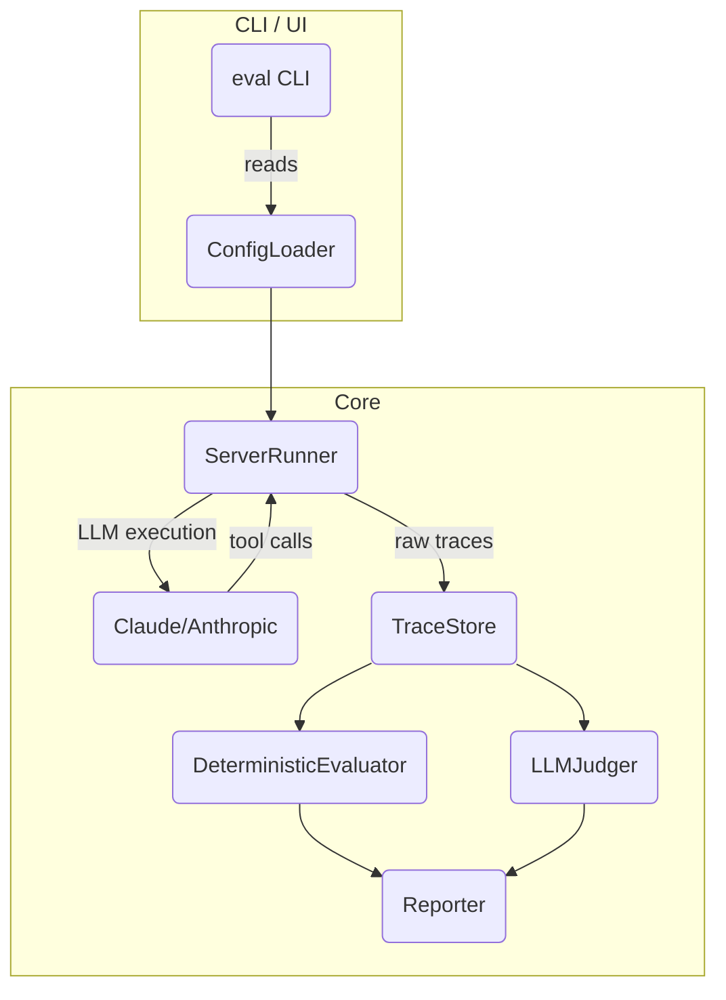

# MCP Server Evaluation Library – Technical Specification

## 1. Purpose

Provide a **TypeScript / Next.js** library & CLI that can automatically **evaluate MCP servers** (local `stdio` processes or remote Streaming‐HTTP endpoints). The evaluator uses an LLM (Claude) to autonomously execute workflows based on high-level user intents, then evaluates the results using three core deterministic metrics and an optional LLM judge.

### Key Metrics

1. **End-to-End Workflow Success** – Did the LLM-driven workflow reach the desired end state defined by the test author?
2. **Tool Invocation Order** – Were the _expected_ tools called, in the _expected_ order?
3. **Tool Call Health** – Did every tool call return successfully? • No thrown exceptions • HTTP ≥ 200 < 300 • Result validates against the tool's schema.

If any metric fails the run is **red**. When all pass it is **green**. A fourth, optional metric — _LLM qualitative correctness_ — can be enabled, using `generateText()` from the AI SDK to have GPT-4o grade the run.

### LLM-Driven Approach

Unlike traditional test frameworks that script exact sequences, MCPVals uses Claude to:

- Interpret high-level user intents
- Plan appropriate tool usage
- Execute tools in a natural sequence
- Handle unexpected scenarios adaptively

---

## 2. High-Level Architecture



- **ConfigLoader** – Parses `mcp-eval.config.{json|ts}`.
- **ServerRunner** – Manages MCP server lifecycle and LLM-driven workflow execution:
  - `stdio`: `execa` child-process with pipes.
  - `shttp`: streaming-HTTP (SSE) via `StreamableHTTPClientTransport`.
- **Claude/Anthropic** – Interprets user intents and autonomously executes tool calls.
- **TraceStore** – Records all conversation messages and tool interactions.
- **DeterministicEvaluator** – Scores the LLM-generated trace according to the 3 metrics.
- **LLMJudger** (optional) – Uses AI SDK → OpenAI to grade subjective criteria.
- **Reporter** – Emits results in **pretty console**, **JSON**, or **JUnit XML** (planned).

---

## 3. Public API

### 3.1 Library Entry Point

```ts
import { evaluate } from "mcpvals";

const result = await evaluate("./mcp-eval.config.ts");
```

### 3.2 CLI

```
$ npx mcpvals run --config ./mcp-eval.config.json
$ mcpvals list  # shows available workflows
```

---

## 4. Configuration Schema (`zod`)

```ts
export const WorkflowSchema = z.object({
  name: z.string(),
  description: z.string().optional(),
  steps: z.array(
    z.object({
      user: z.string(), // high-level user intent
      expectTools: z.array(z.string()).optional(), // deprecated - use workflow-level
      expectedState: z.string().optional(), // substring to find in final output
    }),
  ),
  expectTools: z.array(z.string()).optional(), // expected tools for entire workflow
});

export const ServerSchema = z.discriminatedUnion("transport", [
  z.object({
    transport: z.literal("stdio"),
    command: z.string(),
    args: z.array(z.string()).optional(),
  }),
  z.object({ transport: z.literal("shttp"), url: z.string().url() }),
]);

export const ConfigSchema = z.object({
  server: ServerSchema,
  workflows: z.array(WorkflowSchema),
  llmJudge: z.boolean().default(false),
  openaiKey: z.string().optional(),
});
```

---

## 5. File/Folder Layout

```
src/
  cli/
    index.ts          # commander.js program entry (existing)
    eval.ts           # new `mcp-eval` command
  eval/
    index.ts          # re-export public API
    config.ts         # zod schemas & loader
    runner.ts         # ServerRunner impl
    trace.ts          # TraceStore
    deterministic.ts  # metric 1-3 evaluators
    llm.ts            # optional AI-SDK powered judge
    reporters/
      console.ts
      json.ts
      junit.ts
  types/
    index.d.ts        # shared type declarations

docs/
  eval-library-spec.md   # ← this file
```

### Key Dependencies

1. **Core**:
   - `@modelcontextprotocol/sdk` - MCP client/server communication
   - `@ai-sdk/anthropic` - Claude for workflow execution
   - `@ai-sdk/openai` - GPT-4 for optional LLM judge
   - `ai` - Vercel AI SDK for LLM orchestration
2. **Utilities**:
   - `zod` - Configuration validation
   - `execa` - Process management for stdio servers
   - `chalk` - Console output formatting
   - `commander` - CLI framework

---

## 6. Deterministic Evaluation Algorithms

1. **End-to-End Success**
   - Last assistant message must contain `expectedState` (case-insensitive substring match) OR last tool result contains the expected state.
2. **Tool Invocation Order**
   - Extract ordered list of `tool.name` from LLM-generated trace.
   - Compare to workflow-level `expectTools` array (or flattened step-level arrays for backwards compatibility).
   - Partial credit given: score = matched_tools / expected_tools.
3. **Tool Call Health**
   - For each tool result in the trace:
     - Check for errors or exceptions.
     - If transport is HTTP → response status 200-299.
     - Future: Validate against tool's output schema.

Scoring: Each metric 0-1, overall = average. Workflow passes only if all metrics pass.

---

## 7. LLM Judge Flow (optional)

1. Serialize conversation & tool traces into a **system prompt**.
2. Ask model to output JSON `{ "score": 0-1, "reason": string }`.
3. Merge into final report.

Example snippet:

```ts
const { text } = await generateText({
  model: openai("gpt-4o"),
  prompt: buildJudgingPrompt(trace, workflow),
});
```

---

## 8. Extensibility Roadmap (post-MVP)

- **GitHub Actions reporter** – Fail CI if score < threshold.
- **HTML dashboard** – Interactive replay of traces.
- **JUnit** – Enable integration with existing test dashboards.
- **Coverage metric** – % of tools exercised across all workflows.
- **Parallel runs** – Spawn multiple server instances for speed.

---

## 9. Security Considerations

- **Sandboxed child processes** – Disable network if not required.
- **Rate limiting** remote HTTP tests.
- **Redact secrets** from logs.

---

## 10. Next Steps

1. Merge this spec.
2. Scaffold the folders & files (`pnpm exec dash-scripts` or manual).
3. Implement **ConfigLoader** + **ServerRunner** first to unblock end-to-end smoke test.
4. Add deterministic evaluators.
5. Integrate AI SDK judge behind `--llm` flag.
6. Publish `0.1.0` on npm.
