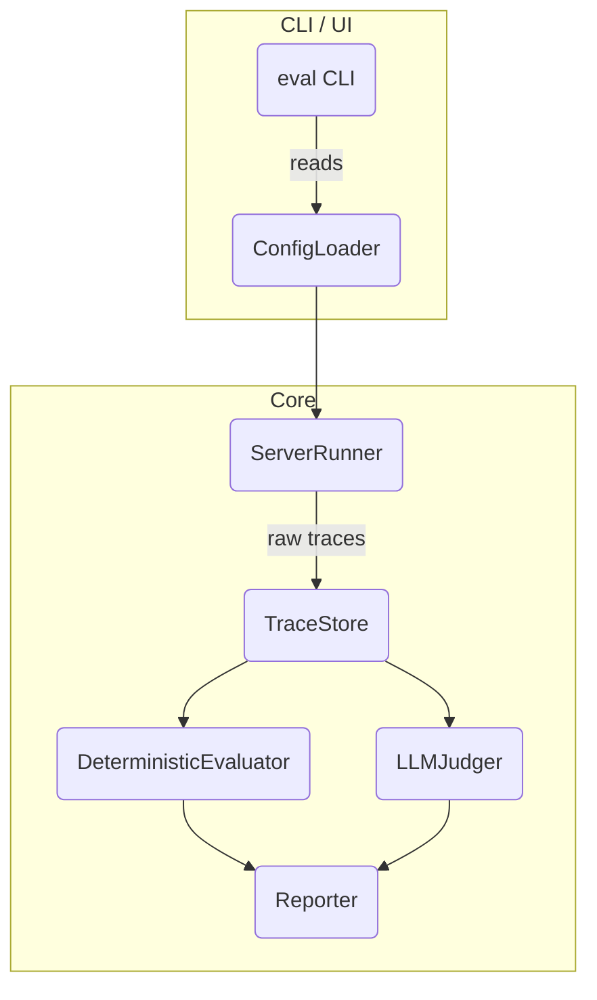

# MCP Server Evaluation Library – Technical Specification

## 1. Purpose

Provide a **TypeScript / Next.js** library & CLI that can automatically **evaluate MCP servers** (local `stdio` processes or remote Streaming‐HTTP endpoints). The evaluator focuses on three core, deterministic metrics and can optionally delegate to an LLM judge via Vercel AI SDK.

### Key Metrics

1. **End-to-End Workflow Success** – Did the LLM reach the desired end state defined by the test author?
2. **Tool Invocation Order** – Were the _expected_ tools called, in the _expected_ order, with the _expected_ arguments?
3. **Tool Call Health** – Did every tool call return successfully? • No thrown exceptions • HTTP ≥ 200 < 300 • Result validates against the tool's `zod` schema / description.

If any metric fails the run is **red**. When all pass it is **green**. A fourth, optional metric — _LLM qualitative correctness_ — can be enabled, using `streamText()` or `generateText()` from the AI SDK to have GPT-4o grade the run.

---

## 2. High-Level Architecture



- **ConfigLoader** – Parses `mcp-eval.config.{json|ts}`.
- **ServerRunner** – Spins up and communicates with the target MCP server using the Model Context Protocol SDK client. Supports:
  - `stdio`: `execa` child-process with pipes.
  - `shttp`: streaming-HTTP (SSE) via fetch / `EventSource`.
- **TraceStore** – Canonical log of MCP messages exchanged during a run.
- **DeterministicEvaluator** – Pure functions that score the run according to the 3 metrics.
- **LLMJudger** (optional) – Uses AI SDK → OpenAI/Anthropic to grade complex/subjective criteria.
- **Reporter** – Emits results in **pretty console**, **JSON** (`--json`), or **JUnit XML** (`--junit`).

---

## 3. Public API

### 3.1 Library Entry Point

```ts
import { evaluate } from "@mcpvals";

const result = await evaluate("./mcp-eval.config.ts");
```

### 3.2 CLI

```
$ npx mcpvals run --config ./mcp-eval.config.json
$ mcpvals list  # shows available workflows
```

---

## 4. Configuration Schema (`zod`)

```ts
export const WorkflowSchema = z.object({
  name: z.string(),
  description: z.string().optional(),
  steps: z.array(
    z.object({
      user: z.string(), // user message
      expectTools: z.array(z.string()).optional(), // expected tools (order matters)
      expectedState: z.string().optional(), // free-form description for LLM judge
    }),
  ),
});

export const ServerSchema = z.discriminatedUnion("transport", [
  z.object({
    transport: z.literal("stdio"),
    command: z.string(),
    args: z.array(z.string()).optional(),
  }),
  z.object({ transport: z.literal("shttp"), url: z.string().url() }),
]);

export const ConfigSchema = z.object({
  server: ServerSchema,
  workflows: z.array(WorkflowSchema),
  llmJudge: z.boolean().default(false),
  openaiKey: z.string().optional(),
});
```

---

## 5. File/Folder Layout

```
src/
  cli/
    index.ts          # commander.js program entry (existing)
    eval.ts           # new `mcp-eval` command
  eval/
    index.ts          # re-export public API
    config.ts         # zod schemas & loader
    runner.ts         # ServerRunner impl
    trace.ts          # TraceStore
    deterministic.ts  # metric 1-3 evaluators
    llm.ts            # optional AI-SDK powered judge
    reporters/
      console.ts
      json.ts
      junit.ts
  types/
    index.d.ts        # shared type declarations

docs/
  eval-library-spec.md   # ← this file
```

### Changes to existing scaffolding

1. **package.json** –
   - Rename package to `@mcpvals` (or publish as a separate workspace).
   - Add deps: `@modelcontextprotocol/sdk`, `zod`, `execa`, `chalk`, `@ai-sdk/openai`.
2. **tsconfig.json** – Include `src/eval/**/*`.
3. **CLI** – Wire new `eval` subcommand in `src/cli/index.ts`.

---

## 6. Deterministic Evaluation Algorithms

1. **End-to-End Success**
   - Last assistant message must contain `desiredState` (string match or regex) OR last tool result satisfies `expectedState` predicate.
2. **Tool Invocation Order**
   - Extract ordered list of `tool.name` from trace.
   - Compare to `expectTools` array using deep equality → fail index of first mismatch.
3. **Tool Call Health**
   - For each tool result:
     - If transport is HTTP → response status 200-299.
     - Validate returned payload against tool's param/return schemas.

Scoring: pass = 1, fail = 0. Produce aggregate as percentage.

---

## 7. LLM Judge Flow (optional)

1. Serialize conversation & tool traces into a **system prompt**.
2. Ask model to output JSON `{ "score": 0-1, "reason": string }`.
3. Merge into final report.

Example snippet:

```ts
const { text } = await generateText({
  model: openai("gpt-4o"),
  prompt: buildJudgingPrompt(trace, workflow),
});
```

---

## 8. Extensibility Roadmap (post-MVP)

- **GitHub Actions reporter** – Fail CI if score < threshold.
- **HTML dashboard** – Interactive replay of traces.
- **JUnit** – Enable integration with existing test dashboards.
- **Coverage metric** – % of tools exercised across all workflows.
- **Parallel runs** – Spawn multiple server instances for speed.

---

## 9. Security Considerations

- **Sandboxed child processes** – Disable network if not required.
- **Rate limiting** remote HTTP tests.
- **Redact secrets** from logs.

---

## 10. Next Steps

1. Merge this spec.
2. Scaffold the folders & files (`pnpm exec dash-scripts` or manual).
3. Implement **ConfigLoader** + **ServerRunner** first to unblock end-to-end smoke test.
4. Add deterministic evaluators.
5. Integrate AI SDK judge behind `--llm` flag.
6. Publish `0.1.0` on npm.
