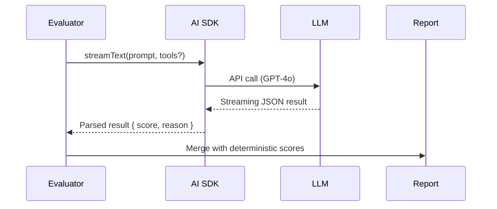

# LLM Judge

This document describes the LLM Judge feature in MCPVals, which provides qualitative evaluation of workflows beyond deterministic metrics.

## Overview

The LLM Judge uses GPT-4 to evaluate the quality of LLM-driven workflow executions. Since the primary workflow execution already uses Claude, the judge provides an independent assessment of:

- Answer relevance and completeness
- Appropriate tool usage
- Conversation naturalness
- Achievement of user intent

## Architecture

1. **Separation of Concerns**: Claude executes workflows, GPT-4 judges them
2. **Post-Execution**: Runs after deterministic metrics are calculated
3. **Non-Blocking**: Failures don't affect deterministic results
4. **Configurable**: Enable via config (`llmJudge: true`) and CLI (`--llm`)

## 2 – High-Level Flow



## 3 – Scoring Schema

```ts
interface LlmJudgeResult {
  score: number; // 0-1 float
  reason: string; // LLM explanation
}
```

Map to an `EvaluationResult` with:

- `metric = "LLM Judge"`
- `passed = score >= passThreshold` (default 0.8)

## 4 – Prompt Template

```text
System: You are an expert evaluator. Return ONLY valid JSON.
User:
<workflow name="${name}">
${conversationDump}
</workflow>
<expected>
${expectedState}
</expected>

Provide: {"score":0-1,"reason":"…"}
```

### Conversation Dump Strategy

1. Last **N** messages (configurable, default all)
2. Concatenate tool results & assistant responses
3. Trim to model max-tokens (AI SDK handles truncation if we set `maxTokens`)

## Current Implementation

The LLM Judge is fully implemented in MCPVals:

### Configuration

```ts
{
  llmJudge: true,              // Enable LLM judge
  openaiKey: "sk-...",         // Or use OPENAI_API_KEY env var
  judgeModel: "gpt-4o",        // Model to use for judging
  passThreshold: 0.8           // Score threshold for passing
}
```

### Usage

```bash
# Enable via CLI flag
npx mcpvals eval config.json --llm

# Or set in config file
{
  "llmJudge": true,
  "openaiKey": "${OPENAI_API_KEY}"
}
```

### How It Works

1. **Conversation Serialization**: Last 20 messages + tool calls are formatted
2. **Prompt Construction**: Includes workflow context and expected state
3. **GPT-4 Evaluation**: Returns `{ score: 0-1, reason: "..." }`
4. **Result Integration**: Added as 4th metric in evaluation results

### Error Handling

- Invalid JSON responses: Score = 0, but doesn't crash
- API failures: Marked as failed metric, deterministic results preserved
- Missing API key: Skips LLM judge, continues with deterministic metrics

## 6 – Security & Cost

- **API Keys** should be passed via config file or `OPENAI_API_KEY` env.
- **Cost Control**: limit prompts to N messages and set `maxTokens`.
- **Rate Limiting**: Optional exponential back-off retry wrapper.

## 7 – Future Enhancements

1. **Tool-Aware Judging** – Send trace metadata so LLM can reason about tool usage.
2. **Streaming UI** – Surface streaming eval results in real time.
3. **Multi-Model Voting** – Ensemble average across models.
4. **Fine-Tuned Rubrics** – Custom prompt sections per workflow.

---
