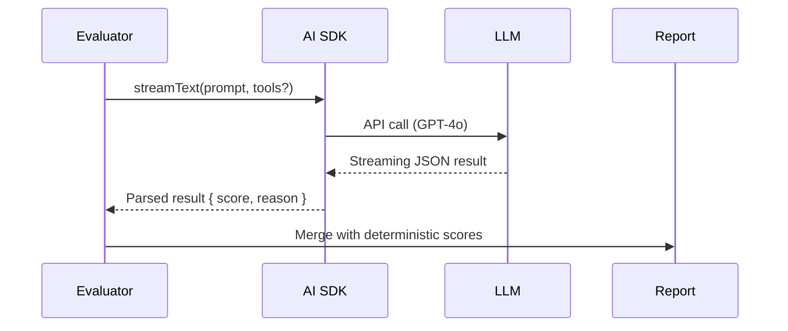

# LLM Judge

This document outlines the architecture and implementation steps to add **LLM-as-a-Judge** evaluation to MCPVals using the [Vercel AI SDK](https://sdk.vercel.ai/docs).

## 1 – Goals

1. **Qualitative Scoring** – Let an LLM grade workflows that deterministic rules can't capture (e.g. answer relevance, tone, completeness).
2. **Configurable** – Enable/disable globally (`llmJudge: true`) or per-run (`--llm` flag).
3. **Non-Blocking** – Run after deterministic metrics; if the call fails, deterministic results still stand.
4. **Pluggable** – Support multiple providers (OpenAI, Anthropic, xAI) via AI SDK.

## 2 – High-Level Flow



## 3 – Scoring Schema

```ts
interface LlmJudgeResult {
  score: number; // 0-1 float
  reason: string; // LLM explanation
}
```

Map to an `EvaluationResult` with:

- `metric = "LLM Judge"`
- `passed = score >= passThreshold` (default 0.8)

## 4 – Prompt Template

```text
System: You are an expert evaluator. Return ONLY valid JSON.
User:
<workflow name="${name}">
${conversationDump}
</workflow>
<expected>
${expectedState}
</expected>

Provide: {"score":0-1,"reason":"…"}
```

### Conversation Dump Strategy

1. Last **N** messages (configurable, default all)
2. Concatenate tool results & assistant responses
3. Trim to model max-tokens (AI SDK handles truncation if we set `maxTokens`)

## 5 – Implementation Steps

1. **New Config Options** (`config.ts`)
   ```ts
   llmJudge: z.boolean().default(false),
   openaiKey: z.string().optional(),
   judgeModel: z.string().default('gpt-4o'),
   passThreshold: z.number().min(0).max(1).default(0.8)
   ```
2. **Add Dependency**
   ```bash
   pnpm add ai @ai-sdk/openai
   ```
3. **Create `src/eval/llm-judge.ts`**

   ```ts
   import { generateText } from "ai";
   import { openai } from "@ai-sdk/openai";

   export async function runLlmJudge(args: {
     model: string;
     apiKey: string;
     prompt: string;
   }): Promise<LlmJudgeResult> {
     const { text } = await generateText({
       model: openai(args.model, { apiKey: args.apiKey }),
       prompt: args.prompt,
       maxTokens: 512,
     });
     return JSON.parse(text) as LlmJudgeResult;
   }
   ```

4. **Update `evaluate()` in `index.ts`**
   1. Build prompt from `traceStore` + workflow.
   2. Call `runLlmJudge()`.
   3. Push result into `evaluation.results`.
5. **Reporter Updates**
   - Console reporter shows LLM score & reason.
   - JSON output already serializes it.
6. **CLI Flag**
   - `--llm` already exists; map to `EvaluateOptions.llmJudge`.
7. **Error Handling**
   - Catch JSON parse errors – set `passed = false`, `score = 0`, `reason = 'Invalid LLM output'`.
   - Timeout / API errors – mark metric as failed but don't crash run.

## 6 – Security & Cost

- **API Keys** should be passed via config file or `OPENAI_API_KEY` env.
- **Cost Control**: limit prompts to N messages and set `maxTokens`.
- **Rate Limiting**: Optional exponential back-off retry wrapper.

## 7 – Future Enhancements

1. **Tool-Aware Judging** – Send trace metadata so LLM can reason about tool usage.
2. **Streaming UI** – Surface streaming eval results in real time.
3. **Multi-Model Voting** – Ensemble average across models.
4. **Fine-Tuned Rubrics** – Custom prompt sections per workflow.

---

_Last updated: {{DATE}}_
